# Projeto Minefield

# Descrição Resumida do Projeto
Minefield é um jogo competitivo para 2 ou mais jogadores. Dispute com seus amigos para ver quem encontra mais gemas dentro de uma mina representada por um espaço celular. Gaste suas gemas para usar recursos poderosos, como um detector de gemas ou plantando uma bomba que faz quem encontrá-la perder todas as gemas! Nesse jogo altamente customizável, leve e simples, ganha quem souber aproveitar melhor as gemas que encontrar!

# Equipe
* Bruna Rodrigues Barbosa - RA 194966
* Cauan Newton Alves Souza - RA 195620

# Vídeo do Projeto
## Vídeo da Prévia

## Vídeo do Jogo
[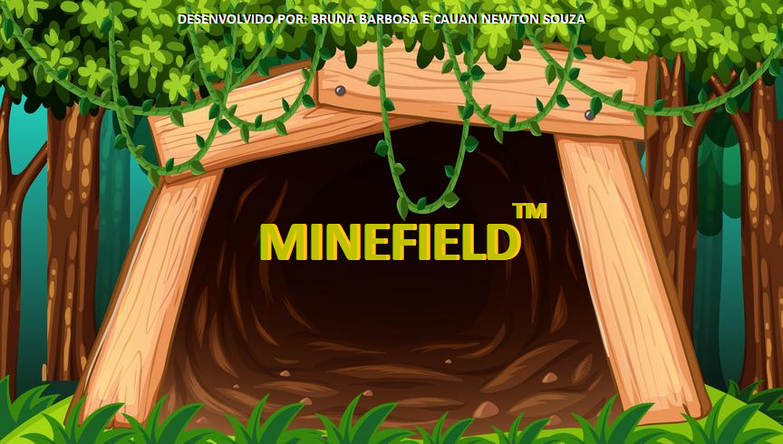](https://drive.google.com/file/d/1h8wbmQdm3dRtPWtcCNihNFoI0OQtboj3/view?usp=sharing)

# Slides do Projeto

## Slides da Prévia
[Link para os slides](https://docs.google.com/presentation/d/1yb26aykyLqy626uItrTmpXIRKxinTik2M1ZeQIV17pM/edit?usp=sharing)

## Slides da Apresentação Final
[link para os slides](https://docs.google.com/presentation/d/1YpxciGEAO1BESnD6pt4gv8nIQ6txXdxXmmpQrLz0dGE/edit?usp=sharing)

## Relatório de Evolução

# Destaques de Código

~~~java
"public Board(int tamanho, int gemasPraColocar) {
        double gemChance = (double)(gemasPraColocar)/(double)(tamanho);
        Celulas = new ICell[tamanho];
        for(int i = 0; i < tamanho; i++) {
            Celulas[i] = new Cell();
            if (gemasPraColocar > 0) {
                if (tamanho - i <= gemasPraColocar) {
                    Celulas[i].setConteudo(new Gema());
                    gemasPraColocar--;
                } else if (Math.random() < gemChance) {
                    Celulas[i].setConteudo(new Gema());
                    gemasPraColocar--;
                }
            }
        }
    }"
~~~
~~~java
"public void imprimirStart() {
        String IMG_PATH = "assets/img/start/";
        setTitle("Minefield - Main Menu");
        getContentPane().removeAll();
        add(Box.createHorizontalGlue());
        IconButton buttonStart = new IconButton(IMG_PATH + "start");
        buttonStart.setActionCommand("game");
        buttonStart.addActionListener(this);
        IconButton buttonSettings = new IconButton(IMG_PATH + "settings");
        buttonSettings.setActionCommand("settings");
        buttonSettings.addActionListener(this);
        IconButton buttonExit = new IconButton(IMG_PATH + "exit");
        buttonExit.setActionCommand("exit");
        buttonExit.addActionListener(this);
        JPanel panelButtons = new JPanel();
        panelButtons.setLayout(new BoxLayout(panelButtons, BoxLayout.Y_AXIS));
        panelButtons.add(buttonStart);
        panelButtons.add(buttonSettings);
        panelButtons.add(buttonExit);
        Background logo = new Background(IMG_PATH + "background", Resolution);
        logo.setSize(new Dimension(Settings.getWindowWidth(), Settings.getWindowHeight()));
        logo.setLayout(new BoxLayout(logo, BoxLayout.Y_AXIS));
        logo.add(Box.createVerticalGlue());
        logo.add(panelButtons);
        panelButtons.setAlignmentX(CENTER_ALIGNMENT);
        logo.add(Box.createRigidArea(new Dimension(0, Settings.getWindowHeight()/10)));
        add(logo);
        add(Box.createHorizontalGlue());
        pack();
        repaint();
    }"
~~~

~~~java
"boolean runGame = true;
        while (runGame) {
            synchronized (Janela) {
                try {
                    Janela.wait(); 
                } catch (InterruptedException e) {
                    runGame = false;
                    System.out.println(e.getMessage());
                    System.out.println("An unexpected error happened and the game will be closed.");
                }
            }
            LastAction = Janela.getLastAction();
            switch(LastAction) {
            case "start":
                Janela.imprimirStart();
                break;
            case "game":
                new Game(Janela);
                break;
            case "settings":
                Janela.imprimirSettings();
                break;
            case "exit":
                Janela.setVisible(false);
                runGame = false;
                break;
            default:
                break;
            }
        }"
~~~

# Destaques de Pattern
Um dos principais utilizados foi o Pattener Observer

## Diagrama do Pattern
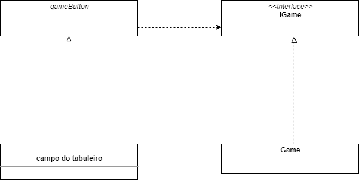

## Código do Pattern
~~~java
"GameButton[] GameButton = new GameButton[size*size];
        for (int i = 0; i < size * size; i++) {
            GameButton[i] = new GameButton(IMG_PATH, Game.getBoard().getCell(i));
            GameButton[i].setActionCommand(Integer.toString(i));
            ...
            GameButton[i].addActionListener(Game);
        }"
~~~
O pattern que melhor se encaixou para o nosso jogo foi o observer pois em nosso jogo precisamos sempre estar atentos aos comandos ocorridos na janela, ou seja a informação recebida pelo gameButton através do campo do tabuleiro é interpretada pela interface IGame no qual envia para a classe Game. A grande vantagem em utilizar esse padrão é que o game não precisa ficar verificando a todo momento o estado dos botões do jogo, esse modo faz com que ele apenas precise esperar uma notificação do botão. 

# Conclusões e Trabalhos Futuros
Executar esse projeto foi bem interessante por permitir aplicarmos nossos conhecimentos sobre Programação Orientada a Objetos. Diversos conceitos como herança, polimorfismo, interfaces, tratamento de exceções, entre outros, puderam ser aplicados no projeto e inclusive trouxeram uma facilitação no processo de montagem do software. Naturalmente, também foi possivel por em prática nossas habilidades de design, não só no contexto do código como no contexto dos elementos do jogo (mecânicas, componentes visuais, interação com o usuário, etc.). Ambas as habilidades são de grande importância para um programador, então desenvolver um projeto desse porte naturalmente trouxe grandes resultados.

Sobre os processos que decorreram ao longo do projeto, iniciamos com uma etapa de planejamento do escopo do jogo. Desde o início buscamos nos atentar às limitações do Java Swing (principal biblioteca gráfica que utilizamos) e quais mecânicas seriam factíveis de implementar. Felizmente, a biblioteca Java Swing se mostrou bem poderosa, e nossas verdadeiras limitações estavam mais relacionadas à nossa criatividade e principalmente à gestão de tempo do projeto.

Tendo o tempo como principal fator limitante, rapidamente tivemos que filtrar as componentes essenciais do projeto e deixar as componentes não essenciais de lado. Felizmente, foi possível montar todas as componentes essenciais: a base do jogo, mecânica de habilidades, customização das configurações do jogo e uma interface gráfica responsiva. Para dar foco a esses elementos, outras ideias foram sacrificadas: controle das configurações dentro do próprio jogo (atualmente isso é feito em um arquivo externo), efeitos sonoros, música, balanceamento de habilidades e até customização de habilidades. Também poderíamos ter explorado melhor o conceito de Design Patterns, que era um assunto que não dominávamos muito bem, mas que é de grande importância no universo de Desenvolvimento de Software. Claro que esses elementos ainda podem ser explorados e implementados, sendo necessário apenas mais tempo de trabalho no projeto.

Foi interessante também como superamos uma limitação intrinsíca do jogo: ele se trata de um jogo para mais de um jogador, mas atualmente só é possível jogar com varias pessoas localmente. Solucionamos isso com a ajuda de um software externo, o Parsec, que permite o acesso remoto de um computador à outro e consequentemente permite que várias pessoas consigam jogar por rede, mesmo que o jogo tenha apenas multiplayer local.

Mesmo com as limitações de tempo, o rendimento do projeto foi significativo. Que nem dito anteriormente, pudemos aplicar nossos aprendizados da área de Programação Orientada a Objetos, e o projeto como um todo foi bem gratificante de executar.

# Documentação dos Componentes
# Diagramas
## Diagrama Geral do Projeto
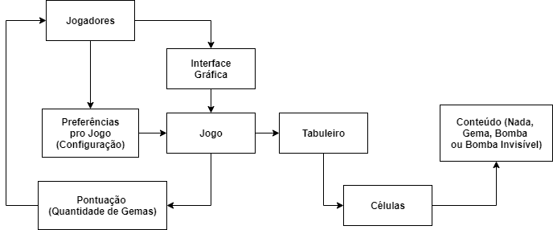

## Diagrama Geral de Componentes
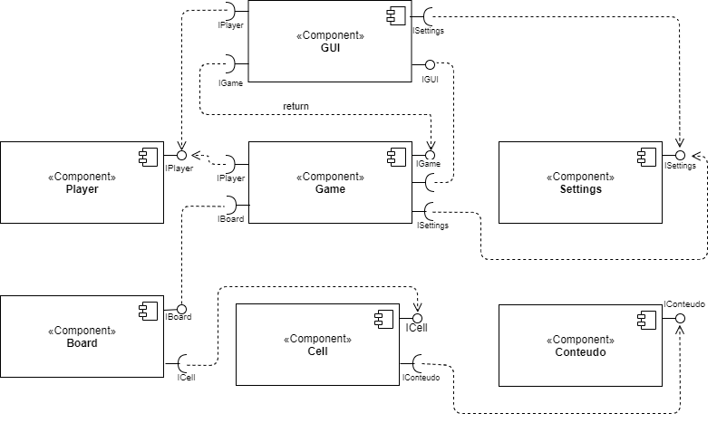

## Componente GUI
Fornece metodo de interface grafica

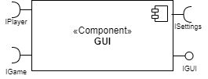

**Ficha Técnica**
item | detalhamento
----- | -----
Classe | src.bin.GUI
Autores | Bruna Rodrigues Barbosa   Cauan Newton Alves Souza
Interfaces | IGUI

### Interfaces

Interfaces associadas a esse componente:

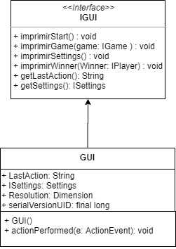

Interface agregadora do componente em Java:

~~~java
public interface IGUI extends ActionListener{
}
~~~

## Detalhamento das Interfaces

### Interface IGUI
Define métodos para a impressão da interface gráfica do jogo.

Método | Objetivo
-------| --------
imprimirStart | Imprime o menu inicial do programa, dando caminho pras configurações ou pra iniciar o jogo. Não tem retorno. 
imprimirGame | Imprime o jogo
imprimeSettings | Imprime o menu para configuração do jogo. Recebe um parâmetro Settings e imprime seus atributos. Não tem retorno.
imprimirWinner| Imprime uma tela mostrando o vencedor da partida. Recebe um parâmetro Player que representa o vencedor e imprime sua pontuação. Não tem retorno.
getLastAction | retorna a ultima ação que intrface grafica reconheceu que o jogador fez. usada pelo componente que criou a interface grafica
getSettings | retorna um atributo que a interface tem salva

## Componente Settings
Armazena as configurações do jogo

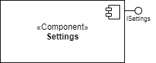

**Ficha Técnica**
item | detalhamento
----- | -----
Classe | src.bin.Settings
Autores | Bruna Rodrigues Barbosa   Cauan Newton Alves Souza
Interfaces | ISettings

### Interfaces

Interfaces associadas a esse componente:

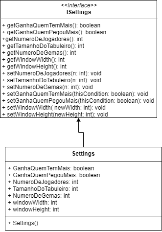

Interface agregadora do componente em Java:

~~~java
public interface ISettings{
}
~~~

## Detalhamento das Interfaces

### Interface ISettings
Interface implementada por qualquer objeto que armazene as regras do jogo.

Método | Objetivo
-------| --------
getGanhaQuemTemMais | informa qual a condição de vitoria do jogo
getGanhaQuemPegouMais | informa qual a condição de vitoria do jogo
getNumeroDeJogadores | informa a quantidade de jogadores
getTamanhoDoTabuleiro |informa o tamanho do tabuleiro
getNumeroDeGemas | informa quantidade de gemas no jogo
getWindowWidth |informa a largura da janela
getWindowHeight | informa a altura da janela
setNumeroDeJogadores | altera o numero de jogadores
setTamanhoDoTabuleiro | altera o tamanho do tabuleiro
setNumeroDeGemas | altera o numero de gemas
setGanhaQuemTemMais | altera a condição de vitoria
setGanhaQuemPegouMais | altera a condição de vitoria
setWindowWidth | altera o lagura da janela
setWindowHeight | altera a altura da janela

## Componente Game
Controla o estado do jogo

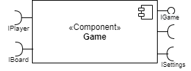

**Ficha Técnica**
item | detalhamento
----- | -----
Classe | src.bin.Settings
Autores | Bruna Rodrigues Barbosa   Cauan Newton Alves Souza
Interfaces | IGame

### Interfaces

Interfaces associadas a esse componente:

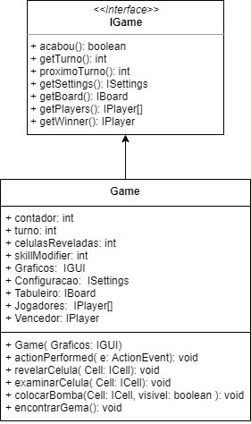

Interface agregadora do componente em Java:

~~~java
public interface IGame extends ActionListener {
}
~~~

## Detalhamento das Interfaces

### Interface IGame
Determina os métodos que permitem o controle do estado do jogo.

Método | Objetivo
-------| --------
acabou | verifica se o jogo está no fim
getTurno | informa o jogador que joga
proximoTurno | informa a proxima pessoa a jogar
getSettings | retorna as configurações do jogo
getBoard | retorna o tabuleiro
getPlayers | retorna os jogadores
getWinner | retorna o vencedor

## Componente Player
Armazena informações sobre os jogadores, referente a pontuação e indentificão do jogador

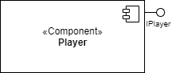

**Ficha Técnica**
item | detalhamento
----- | -----
Classe | src.bin.Player
Autores | Bruna Rodrigues Barbosa   Cauan Newton Alves Souza
Interfaces | IPlayer

### Interfaces

Interfaces associadas a esse componente:

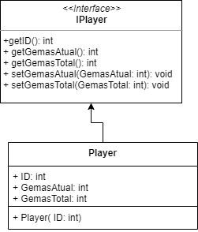
Interface agregadora do componente em Java:

~~~java
public interface IPlayer{
}
~~~

## Detalhamento das Interfaces

### Interface IPlayer.
Fornece os métodos para controlar a pontuação dos jogadores.

Método | Objetivo
-------| --------
getID | retorna a indentificação do jogador
getGemasAtual | Retorna o total de gemas que um dado jogador pegou ao longo do jogo.
getGemasTotal | Retorna a quantidade atual de gemas de um dado jogador.
setGemasAtual | Altera o total de gemas que um determinado jogador pegou ao longo do jogo. Não tem retorno.
setGemasTotal | Altera a quantidade atual de gemas de um determinado jogador. Não tem retorno.

## Componente Board
Armazena as celulas do Tabuleiro

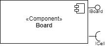

**Ficha Técnica**
item | detalhamento
----- | -----
Classe | src.bin.Board
Autores | Bruna Rodrigues Barbosa   Cauan Newton Alves Souza
Interfaces |IBoard

### Interfaces

Interfaces associadas a esse componente:

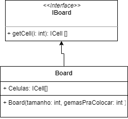
Interface agregadora do componente em Java:

~~~java
public interface IBoard{
}
~~~

## Detalhamento das Interfaces

### Interface IBoard
Interface com os métodos referentes às jogadas possíveis no jogo.

Método | Objetivo
-------| --------
getCell | retorna uma determinada celula

## Componente Cell
Armazena o estado de cada celula do jogo

**Ficha Técnica**
item | detalhamento
----- | -----
Classe |src.bin.Cell
Autores | Bruna Rodrigues Barbosa   Cauan Newton Alves Souza
Interfaces | ICell

### Interfaces

Interfaces associadas a esse componente:

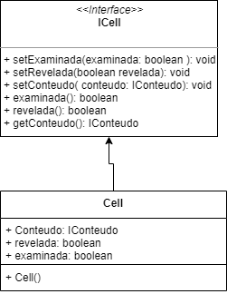
Interface agregadora do componente em Java:

~~~java
public interface ICell {
}
~~~

## Detalhamento das Interfaces

### Interface ICell
Padroniza os métodos para a manipulação das células.

Método | Objetivo
-------| --------
setExaminada | altera se a celula já foi examinada
setRevelada | altera de a celula já foi revelada
setConteudo | altera o conteudo da celula
examinada | avisa de a celula já foi examinada
revelada | avisa se a celula já foi revelada
getConteudo | informa o conteudo da celula

## Componente Conteudo
Armazena o conteudo da celula

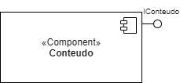

**Ficha Técnica**
item | detalhamento
----- | -----
Classe | src.bin.Conteudo
Autores | Bruna Rodrigues Barbosa   Cauan Newton Alves Souza
Interfaces | IConteudo

### Interfaces

Interfaces associadas a esse componente:

Interface agregadora do componente em Java:

~~~java
public interface IConteudo {
}
~~~

## Detalhamento das Interfaces

### Interface IConteudo
Define o conteúdo de uma célula.

Método | Objetivo
-------| --------
visivel | retorna se o conteudo é visivel ou não

# Plano de Exceções

## Diagrama da hierarquia de exceções

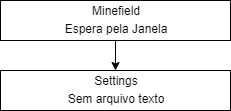

## Descrição das classes de exceção

Classe | Descrição
----- | -----
Settings | Quando não há um arquivo txt existente
minefield | Quando a interfaace grafica é interronpida de alguma maneira inesperada
